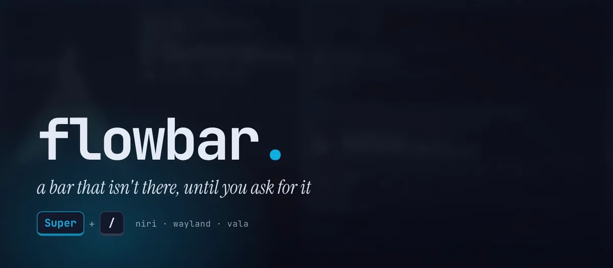
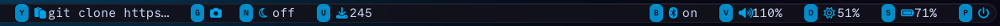
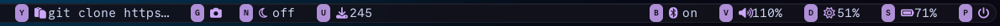
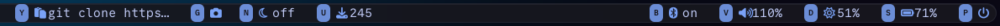
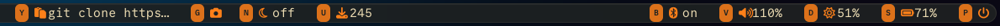
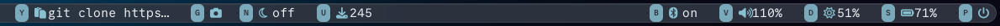
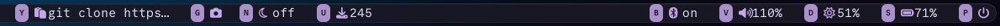

<div align="center">



# flowbar

**A bar that isn't there, until you ask for it.**

Your windows get the whole screen. Press <kbd>Super</kbd>&nbsp;+&nbsp;<kbd>/</kbd> and a bar unfolds across the top,<br>
your windows glide down to make room, and every panel is a single key away.<br>
Press it again and the screen is yours.

[](https://github.com/YaLTeR/niri)
[](https://wayland.freedesktop.org)
[](https://vala.dev)

[Install](#install) · [Keys](#keys) · [Configure](#configure) · [Themes](#themes) · [Custom modules](#custom-modules) · [How it works](#how-it-works) · [Hacking](#hacking)

</div>

<br>

## Why

Most bars rent a strip of your screen forever to show you the time. flowbar only shows up when you want something, and it's built to be driven without the mouse.

- **Out of the way.** Hidden, it takes no pixels and polls nothing.
- **One key, then one letter.** <kbd>Super</kbd>+<kbd>/</kbd> to summon, a letter for each panel, <kbd>Esc</kbd> to back out.
- **Moves like niri.** Windows slide down to make room and slide back up when it leaves, eased like the bar itself.
- **One file.** Theme, layout, keys, icons and commands all live in one `config.ini`, and saving it restyles the open bar on the spot.
- **Made to be riced.** Six themes, every color overridable, CSS variables for your own stylesheet, and any shell command can become a module.

<br>

## Install

flowbar targets Arch Linux with [niri](https://github.com/YaLTeR/niri). Any Wayland compositor with layer-shell should work, but niri is where it's at home.

```sh
sudo pacman -S --needed vala gtk4 gtk4-layer-shell json-glib
git clone https://github.com/noturbob/Flowbar && cd Flowbar
make install
```

That puts `flowbar` in `~/.local/bin` and an annotated `config.ini` in `~/.config/flowbar/` (it never overwrites one you already have).

Then add two lines to `~/.config/niri/config.kdl`:

```kdl
spawn-at-startup "flowbar" "--daemon"

binds {
    Mod+Slash hotkey-overlay-title="Toggle flowbar" { spawn "flowbar"; }
}
```

`--daemon` starts flowbar hidden at login and warms up its renderer, so the very first summon is instant. Every later `flowbar` just tells the running one to show or hide.

### Peek on media keys

`flowbar --peek <module>` flashes just that module in a small pill at the top, with its level, then lets it fade. Hold a key and it stays up. Chain it after the command your media keys already run:

```kdl
XF86AudioRaiseVolume  allow-when-locked=true { spawn-sh "wpctl set-volume @DEFAULT_AUDIO_SINK@ 0.1+ && flowbar --peek volume"; }
XF86AudioLowerVolume  allow-when-locked=true { spawn-sh "wpctl set-volume @DEFAULT_AUDIO_SINK@ 0.1- && flowbar --peek volume"; }
XF86AudioMute         allow-when-locked=true { spawn-sh "wpctl set-mute @DEFAULT_AUDIO_SINK@ toggle && flowbar --peek volume"; }
XF86MonBrightnessUp   allow-when-locked=true { spawn-sh "brightnessctl --class=backlight set +10% && flowbar --peek display"; }
XF86MonBrightnessDown allow-when-locked=true { spawn-sh "brightnessctl --class=backlight set 10%- && flowbar --peek display"; }
```

Any module can be peeked. If the bar is already open, the chip itself updates instead.

<details>
<summary><b>Tools flowbar talks to</b></summary>
<br>

| Module | Uses |
|---|---|
| workspaces | `niri msg` (niri's IPC) |
| wifi | `nmcli` (NetworkManager) |
| bluetooth | `bluetoothctl` (bluez-utils) |
| volume | `wpctl`, `pactl` (PipeWire) |
| display | `brightnessctl` |
| media | `playerctl` |
| clipboard | `wl-paste`, `wl-copy` (wl-clipboard) |
| screenshot | niri's built-in screenshot actions |
| notifications | `makoctl` (mako) |
| night | `wlsunset` (optional), `makoctl` |
| updates | `checkupdates` (pacman-contrib), `yay` or `paru` for the AUR |
| power | `swaylock`, `systemctl`, `niri msg` |

Commands that need a terminal (Wi‑Fi passwords, upgrades) open in whatever `[commands] terminal` says, `kitty -e` by default.

</details>

<br>

## Keys

Summon with <kbd>Super</kbd>+<kbd>/</kbd>. Every chip on the bar shows its key: press it to drop that module's panel down right under the chip. <kbd>Esc</kbd> closes the panel (so does the same key again, in most panels), and <kbd>Esc</kbd> once more sends the whole bar away. Arrow keys work anywhere <kbd>h</kbd><kbd>j</kbd><kbd>k</kbd><kbd>l</kbd> do.

| Key | Module | Inside the panel |
|:---:|---|---|
| | **left** | |
| <kbd>o</kbd> | workspaces | every window by workspace · <kbd>j</kbd>/<kbd>k</kbd> + <kbd>Enter</kbd> focus · <kbd>1</kbd>–<kbd>9</kbd> go to workspace |
| <kbd>t</kbd> | time | clock, date, week, uptime |
| <kbd>c</kbd> | calendar | <kbd>h</kbd>/<kbd>l</kbd> day · <kbd>j</kbd>/<kbd>k</kbd> week · <kbd>H</kbd>/<kbd>L</kbd> month · <kbd>g</kbd> today |
| <kbd>m</kbd> | media | <kbd>space</kbd> play/pause · <kbd>h</kbd>/<kbd>l</kbd> previous/next |
| | **center** | |
| <kbd>y</kbd> | clipboard | <kbd>j</kbd>/<kbd>k</kbd> pick · <kbd>Enter</kbd> copy · <kbd>x</kbd> delete · <kbd>X</kbd> clear |
| <kbd>g</kbd> | screenshot | <kbd>a</kbd> area · <kbd>s</kbd> screen · <kbd>w</kbd> window · <kbd>o</kbd> open folder |
| <kbd>a</kbd> | notifications | on screen, then history · <kbd>Enter</kbd> act · <kbd>x</kbd> dismiss · <kbd>X</kbd> all · <kbd>r</kbd> bring back last · <kbd>f</kbd> do not disturb |
| <kbd>n</kbd> | night | <kbd>n</kbd> night light · <kbd>f</kbd> do not disturb |
| <kbd>u</kbd> | updates | <kbd>Enter</kbd> upgrade · <kbd>r</kbd> check now |
| | **right** | |
| <kbd>w</kbd> | wifi | <kbd>j</kbd>/<kbd>k</kbd> pick · <kbd>Enter</kbd> connect or disconnect · <kbd>space</kbd> radio · <kbd>r</kbd> rescan |
| <kbd>b</kbd> | bluetooth | <kbd>j</kbd>/<kbd>k</kbd> pick · <kbd>Enter</kbd> connect or disconnect · <kbd>space</kbd> power |
| <kbd>v</kbd> | volume | <kbd>h</kbd>/<kbd>l</kbd> −/+ · <kbd>m</kbd> mute · <kbd>j</kbd>/<kbd>k</kbd> + <kbd>Enter</kbd> default device · <kbd>i</kbd> inputs/outputs |
| <kbd>d</kbd> | display | <kbd>h</kbd>/<kbd>l</kbd> brightness −/+ |
| <kbd>s</kbd> | system | CPU, memory, temperature, battery |
| <kbd>p</kbd> | power | <kbd>l</kbd> lock · <kbd>s</kbd> suspend · <kbd>e</kbd> log out · <kbd>r</kbd> reboot · <kbd>o</kbd> power off, each pressed **twice** |

An open panel gets first pick of the keyboard, so letters can mean something local there (<kbd>s</kbd> is suspend inside power, not system).

<br>

## Configure

Everything lives in **`~/.config/flowbar/config.ini`**. flowbar watches it: save, and the bar rebuilds itself in place, even while it's open. Every setting has a default, so any line (or the whole file) is optional. The file `make install` gives you documents every option; the highlights:

```ini
[theme]
preset = azure            # azure · catppuccin · tokyo-night · gruvbox · nord · rose-pine
accent = #00A2E8          # override any single color of the preset
font = CommitMono Nerd Font
radius = 22

[bar]
left   = workspaces time calendar media
center = clipboard screenshot notifications night updates
right  = wifi bluetooth volume display system power
margin = auto             # niri's layout `gaps`: the bar sits as far from the edges as your windows do
height = 24               # the size of a stock waybar

[motion]
speed = 1.5               # scales every animation; 1.5 matches niri's `slowdown 1.5`, 0 turns it off

[keys]
power = q                 # rebind any module: a letter, or a key name like F1

[icons]
wifi = 󰖩                  # swap any chip's icon

[commands]
terminal = foot           # anything that runs a command: kitty -e · alacritty -e · wezterm start --
update = paru
lock = hyprlock
```

Module settings sit in their own sections: `[volume] step`, `[display] step`, `[night] temperature`, `[clipboard] keep`, `[updates] interval`, `[screenshot] dir`.

> Mistakes don't fail silently. Run `make run` (or `flowbar` from a terminal) and bad config or CSS is reported with the file and line.

<br>

## Themes

Six presets ship in the box. Each is one line: `preset = <name>`.

| | |
|---|---|
| **azure** · the default |  |
| **catppuccin** |  |
| **tokyo-night** |  |
| **gruvbox** |  |
| **nord** |  |
| **rose-pine** |  |

Any preset color can be overridden in `[theme]`: `accent`, `accent-2` (the active chip, today in the calendar), `background`, `foreground`, `good` ("on" states). Plus `opacity`, `font`, `font-size` and `radius`.

### Going further with `style.css`

For anything past colors, drop a `style.css` next to your config. It's GTK CSS, layered over flowbar's own, reloaded on save, and it can use the same variables the built-in theme uses:

```css
/* square, flat, loud */
.bar, .card  { border-radius: 0; box-shadow: none; }
.chip.active { background: var(--accent); }
.chip.active .icon, .chip.active label { color: var(--background); }
```

| Variables | |
|---|---|
| colors | `--accent` `--accent-2` `--background` `--foreground` `--good` |
| shape | `--opacity` `--radius` `--bar-height` `--gap` `--font` `--font-size` |
| motion | `--t-drop` `--t-fade` `--t-chip` `--t-leave` `--t-quick` (already scaled by `[motion] speed`) |

| Classes | |
|---|---|
| `.flow` | the root; `.flow.hidden` while it's away |
| `.peek` · `.osd` | the `--peek` window and its pill |
| `.bar` · `.chip` · `.chip.active` | the bar and its chips |
| `.key` · `.icon` | a chip's key badge and icon |
| `.card` | the panel under a chip |
| `.row` · `.row.cursor` | list rows and the selected one |
| `.big` · `.sub` · `.dim` · `.status` · `.accent` | panel text |

<br>

## Custom modules

Any shell command can become a module, no code needed. Define it, then list its name in a `[bar]` line:

```ini
[bar]
right = weather wifi bluetooth volume display system power

[custom.weather]
key = e
icon = 
title = Weather
exec = curl -s 'wttr.in/?format=%c+%t'
interval = 900              # seconds between runs while the bar is up
on-enter = xdg-open https://wttr.in

[custom.vpn]
key = x
icon = 󰖂
exec = nmcli -t -f TYPE connection show --active | grep -q vpn && echo on || echo off
on-enter = nmcli connection up id my-vpn
close-on-enter = false      # keep the bar open after Enter
```

The chip shows the first line of the command's output and the panel shows all of it. <kbd>Enter</kbd> runs `on-enter`.

<br>

## How it works

A few details, for the curious:

- **A layer-shell overlay.** flowbar is a GTK 4 window on the overlay layer, anchored to the top and both sides. While it's up it takes the keyboard, so a single letter can mean something.
- **Windows that glide.** When the bar appears it reserves a strip at the top edge, and niri moves your windows out of it. niri snaps windows to a new work area without animating, so flowbar grows that strip a few pixels every frame, eased like its own drop, and the windows follow it down (and back up).
- **Your spacing, not ours.** The gap around the bar comes from niri's own `gaps`, so it lines up exactly with your window edges.
- **One instance.** flowbar is a single-instance GTK application: running `flowbar` again just toggles the one that's already there, which is why a bind can be a plain `spawn "flowbar"`.
- **Quiet when hidden.** Modules only poll while the bar is on screen, and slow checks (package updates) are cached.
- **Clipboard without a daemon.** History comes from `wl-paste --watch` and stays in memory. Copies a password manager marks as sensitive are never recorded.

<br>

## Hacking

flowbar is written in [Vala](https://vala.dev), which compiles to C against GTK 4: a small native binary, GObject underneath, and GTK's CSS engine doing the animation.

```sh
make run      # build, stop any running flowbar, run in the foreground with warnings visible
```

| File | What's in it |
|---|---|
| `src/flowbar.vala` | the app: window, summon and dismiss, keys, panel placement, the `Module` base class and helpers |
| `src/config.vala` | `config.ini` reading, theme presets, the CSS variables |
| `src/style.vala` | the stylesheet |
| `src/custom.vala` | `[custom.NAME]` modules |
| `src/<module>.vala` | one file per built-in module |
| `config.ini` | the annotated default config |

A module is a chip plus a panel. Here's a complete one:

```vala
using Gtk;

class Uptime : Module {
    Label since = label ("", "sub");

    public Uptime () {
        base ("z", "");          // its key and icon
        every = 30;                    // refresh every 30 seconds while the bar is up
        panel.append (label ("Uptime", "status"));
        panel.append (since);
    }

    public override async void refresh () {
        value.label = yield sh ("uptime -p");   // the chip's text
        since.label = yield sh ("uptime -s");
    }

    public override bool on_key (string k) {   // keys while its panel is open
        if (k != "Return") return false;
        in_terminal ("btop");
        return true;
    }
}
```

Register it by name in `make_module ()` in `src/flowbar.vala`, and it can be placed from `[bar]` like any other. Helpers to build with: `sh ()` runs a command and returns its output, `launch ()` fires one off, `in_terminal ()` runs one in the user's terminal, `act ()` runs a command and then refreshes, `dismiss ()` hides the bar, `Picker` is a keyboard-driven list, `key_row ()` makes a key-menu row, and `Config.str / num / flag ()` read settings.

<br>

## Troubleshooting

- **Nothing happens on <kbd>Super</kbd>+<kbd>/</kbd>.** Check that `~/.local/bin` is on niri's `PATH`, or bind the full path.
- **Night light does nothing.** It needs `wlsunset` (`sudo pacman -S wlsunset`). The panel tells you when it's missing.
- **Do not disturb does nothing.** mako needs the mode defined. Add this to `~/.config/mako/config`:
  ```ini
  [mode=do-not-disturb]
  invisible=1
  ```
- **A theme change didn't apply.** Run `make run` and look for a line number: flowbar reports config and CSS mistakes instead of skipping them.

<br>

<div align="center">
<sub>The demo is real footage of flowbar on niri, composed with <a href="https://hyperframes.heygen.com">HyperFrames</a> · a GIF version lives at <a href="docs/demo.gif">docs/demo.gif</a></sub>
</div>
